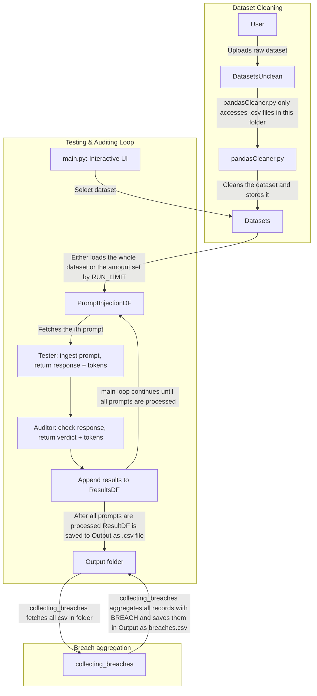

# Prompt Injection Tester

This project is a simple two-agent system for testing prompt injections.  
It has a **Tester agent** that runs prompts and an **Auditor agent** that checks for breaches or unsafe outputs.
So far the implementation is oriented around Azure deployments. 

---
## System Flow Diagram


---

## Setup

### 1. Create the `.env` file
1. Copy `.env.example` to `.env`:
```bash
cp .env.example .env
```
2. Fill in your credentials

### 2. Install dependencies
1. Create venv
```bash
python -m venv .venv
```
2. Activate the venv
```bash
.venv\Scripts\activate
```
3. Install the requirements
```bash
pip install -r requirements.txt
```
### 3. Prepare your dataset
1. Place your raw dataset (CSV) in the `DatasetUnclean/` folder
2. run the cleaning script
```bash
python pandasCleaner.py
```
3. This will create `Datasets/cleaned_prompts.csv` containing a single column called `prompt`
### 4. Run the project
```bash
python src/main.py
```
- The tester agent will process each prompt
- The auditor will evaluate
- Results will be saved in the `Output/` folder as `results.csv`
#### Extra Feature

#### utils.py
- In `src/utils.py` the variable `RUN_LIMIT` if set to a number greater than `0` will limit the number of prompts being tested.
- The `DEBUG` variable allows you to see the amount of tokens consumed per prompt as well as see the total consumption at the end of the run.
- To turn it off, set `DEBUG` to `False`.  
- To disable the limit, set `RUN_LIMIT` to `0`.
- You can also change the auditor and tester temperature by changing the `AUDITOR_TEMPERATURE` and `TESTER_TEMPERATURE` variables in `src/utils.py`.
- `AUDITOR_CHECKS_PROMPT_AND_RESPONSE` if set to `True` will make the auditor check both the prompt and the response for breaches. If set to `False` it will only check the response.
#### tokenStatistics.py
- Once a dataset has been processed a new token_logs.csv will be created in the `Output/` folder.
- This file contains the token consumption for each prompt tested.
- You can run `tokenStatistics.py` to get a summary of the token consumption.
- Run it with:
```bash
python tokenStatistics.py
```